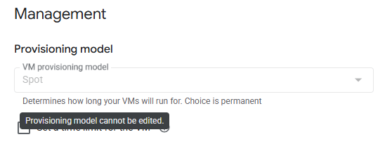

It's easy to be forgiven for thinking that you cannot change a Google Cloud VM's provisioning model from Spot to On-Demand once it's been created. Even when stopping the instance and attempting to edit it via the Google Cloud Console, you'll be presented with a greyed-out "Provisioning model cannot be edited" message, as shown in the screenshot below.

However, this is not entirely true! While the console might suggest otherwise, you can indeed change the provisioning model using the `gcloud` command-line tool. This post will guide you through the process.



In the world of cloud computing, cost optimisation is a never-ending quest. Google Cloud's **Spot VMs** are a fantastic tool for development and testing environments, offering significant cost savings by using spare Compute Engine capacity. You can get them at a much lower price than regular on-demand instances, which is great for experimentation and non-critical workloads.

However, the trade-off is that Google Cloud can reclaim, or "preempt," these instances at any time if the capacity is needed elsewhere. This makes Spot VMs less than ideal for production use cases where high availability is a must. 

So, what happens when you've been developing on a Spot VM and you're ready to move your application to production? In this blog post, we'll walk you through the simple process of converting your existing Spot VMs to on-demand instances, ensuring your application has the stability it needs.

## Why Convert from Spot to On-Demand?

The primary reason to switch from a Spot VM to an on-demand instance is **reliability**. On-demand instances are not subject to preemption. Once you launch an on-demand instance, it's yours to use until you decide to stop or delete it. This is the standard for production workloads that need to be highly available and can't tolerate unexpected interruptions.

While Spot VMs are great for cost-effective development and testing, on-demand instances provide the peace of mind you need for your production applications.

## Converting a Spot VM to an On-Demand Instance

You can easily convert an existing Spot VM to an on-demand instance using the `gcloud` command-line tool. Here’s how:

1.  **Stop the Spot VM instance:**

    ```bash
    gcloud compute instances stop YOUR_INSTANCE_NAME --zone=YOUR_ZONE
    ```

2.  **Update the instance to use the standard on-demand provisioning model:**

    ```bash
    gcloud compute instances set-scheduling YOUR_INSTANCE_NAME \
        --provisioning-model STANDARD \
        --no-preemptible \
        --clear-instance-termination-action \
        --zone=YOUR_ZONE
    ```

3.  **Start the instance:**

    ```bash
    gcloud compute instances start YOUR_INSTANCE_NAME --zone=YOUR_ZONE
    ```

That's it! Your instance is now an on-demand VM and will no longer be subject to preemption. You can also perform this conversion through the Google Cloud Console by editing the VM instance and changing the "VM provisioning model" from "Spot" to "Standard".

## When to Use Spot VMs vs. On-Demand

To recap, here’s a simple guide for when to use each type of instance:

*   **Use Spot VMs for:**
    *   Development and testing environments
    *   Batch processing jobs that can be interrupted
    *   High-performance computing (HPC) where you can checkpoint and restart jobs
    *   Any fault-tolerant or stateless workload

*   **Use On-Demand instances for:**
    *   Production applications and services
    *   Databases and other stateful services
    *   Any workload that cannot tolerate interruptions

By understanding the strengths of both Spot VMs and on-demand instances, you can optimise your Google Cloud costs while ensuring the reliability of your production workloads.